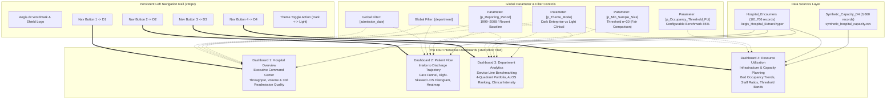

# Aegis.dv – Dashboard Architecture Diagram

```mermaid
graph TD
    subgraph DataLayer ["Data Sources Layer"]
        HE["Hospital_Encounters (101,766 records)<br/>Aegis_Hospital_Extract.hyper"]
        SC["Synthetic_Capacity_D4 (3,660 records)<br/>synthetic_hospital_capacity.csv"]
    end

    subgraph GlobalControls ["Global Parameter & Filter Controls"]
        P_PERIOD["Parameter: [p_Reporting_Period]<br/>1999–2008 / Recent Baseline"]
        P_SAMPLE["Parameter: [p_Min_Sample_Size]<br/>Threshold n=30 (Fair Comparison)"]
        P_THRESH["Parameter: [p_Occupancy_Threshold_Pct]<br/>Configurable Benchmark 85%"]
        P_THEME["Parameter: [p_Theme_Mode]<br/>Dark Enterprise vs Light Clinical"]
        F_DEPT["Global Filter: [department]"]
        F_DATE["Global Filter: [admission_date]"]
    end

    subgraph Dashboards ["The Four Interactive Dashboards (1600x900 Tiled)"]
        D1["Dashboard 1: Hospital Overview<br/>Executive Command Center<br/>Throughput, Volume & 30d Readmission Quality"]
        D2["Dashboard 2: Patient Flow<br/>Intake to Discharge Trajectory<br/>Care Funnel, Right-Skewed LOS Histogram, Heatmap"]
        D3["Dashboard 3: Department Analytics<br/>Service Line Benchmarking<br/>4-Quadrant Portfolio, ALOS Ranking, Clinical Intensity"]
        D4["Dashboard 4: Resource Utilization<br/>Infrastructure & Capacity Planning<br/>Bed Occupancy Trends, Staff Ratios, Threshold Bands"]
    end

    subgraph NavigationRail ["Persistent Left Navigation Rail (240px)"]
        LOGO["Aegis.dv Wordmark & Shield Logo"]
        NAV1["Nav Button 1 -> D1"]
        NAV2["Nav Button 2 -> D2"]
        NAV3["Nav Button 3 -> D3"]
        NAV4["Nav Button 4 -> D4"]
        TOGGLE["Theme Toggle Action (Dark <-> Light)"]
    end

    HE --> D1
    HE --> D2
    HE --> D3
    SC --> D4
    HE --> D4

    P_PERIOD -.-> D1
    P_PERIOD -.-> D2
    P_PERIOD -.-> D3
    P_SAMPLE -.-> D3
    P_THRESH -.-> D4
    P_THEME -.-> D1
    P_THEME -.-> D2
    P_THEME -.-> D3
    P_THEME -.-> D4
    F_DEPT -.-> D1
    F_DEPT -.-> D2
    F_DEPT -.-> D3
    F_DATE -.-> D1
    F_DATE -.-> D2

    NAV1 ==> D1
    NAV2 ==> D2
    NAV3 ==> D3
    NAV4 ==> D4
```

