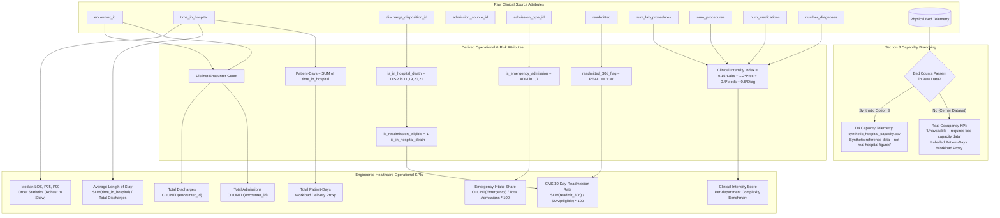

# Aegis.dv – KPI Engineering & Calculation Flowchart

```mermaid
flowchart TD
    subgraph RawFields ["Raw Clinical Source Attributes"]
        EID[encounter_id]
        LOS[time_in_hospital]
        DISP[discharge_disposition_id]
        SRC[admission_source_id]
        ADM[admission_type_id]
        READ[readmitted]
        LABS[num_lab_procedures]
        PROC[num_procedures]
        MEDS[num_medications]
        DIAG[number_diagnoses]
        BEDS[(Physical Bed Telemetry)]
    end

    subgraph DerivedTransform ["Derived Operational & Risk Attributes"]
        VOL[Distinct Encounter Count]
        PDAYS[Patient-Days = SUM of time_in_hospital]
        MORT[is_in_hospital_death = DISP in 11,19,20,21]
        ELIG[is_readmission_eligible = 1 - is_in_hospital_death]
        READ30[readmitted_30d_flag = READ == '<30']
        EMER[is_emergency_admission = ADM in 1,7]
        INTENS[Clinical Intensity Index = 0.15*Labs + 1.2*Proc + 0.4*Meds + 0.6*Diag]
    end

    subgraph OperationalKPIs ["Engineered Healthcare Operational KPIs"]
        K1["Total Admissions<br/>COUNTD(encounter_id)"]
        K2["Total Discharges<br/>COUNTD(encounter_id)"]
        K3["Average Length of Stay<br/>SUM(time_in_hospital) / Total Discharges"]
        K4["Median LOS, P75, P90<br/>Order Statistics (Robust to Skew)"]
        K5["Total Patient-Days<br/>Workload Delivery Proxy"]
        K6["CMS 30-Day Readmission Rate<br/>SUM(readmit_30d) / SUM(eligible) * 100"]
        K7["Emergency Intake Share<br/>COUNT(Emergency) / Total Admissions * 100"]
        K8["Clinical Intensity Score<br/>Per-department Complexity Benchmark"]
    end

    subgraph CapabilityBranches ["Section 3 Capability Branching"]
        BEDS --> GateBed{Bed Counts Present<br/>in Raw Data?}
        GateBed -- No (Cerner Dataset) --> K9_Unavail["Real Occupancy KPI:<br/>'Unavailable – requires bed capacity data'<br/>Labelled Patient-Days Workload Proxy"]
        GateBed -- Synthetic Option 3 --> K9_Synth["D4 Capacity Telemetry:<br/>synthetic_hospital_capacity.csv<br/>'Synthetic reference data – not real hospital figures'"]
    end

    EID --> VOL --> K1
    EID --> VOL --> K2
    LOS --> PDAYS --> K5
    LOS --> K3
    LOS --> K4
    DISP --> MORT --> ELIG
    READ --> READ30
    ELIG --> K6
    READ30 --> K6
    ADM --> EMER --> K7
    LABS --> INTENS --> K8
    PROC --> INTENS
    MEDS --> INTENS
    DIAG --> INTENS
```

