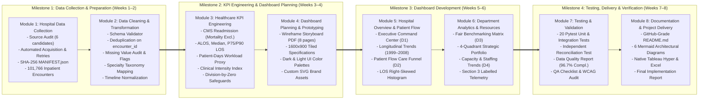

# Aegis.dv – Eight-Module & Four-Milestone Project Workflow

```mermaid
flowchart LR
    subgraph M1 ["Milestone 1: Data Collection & Preparation (Weeks 1–2)"]
        Mod1["Module 1: Hospital Data Collection<br/>- Source Audit (6 candidates)<br/>- Automated Acquisition & Retries<br/>- SHA-256 MANIFEST.json<br/>- 101,766 Inpatient Encounters"]
        Mod2["Module 2: Data Cleaning & Transformation<br/>- Schema Validator<br/>- Deduplication on encounter_id<br/>- Missing Value Audit & Flags<br/>- Specialty Taxonomy Mapping<br/>- Timeline Normalization"]
        Mod1 --> Mod2
    end

    subgraph M2 ["Milestone 2: KPI Engineering & Dashboard Planning (Weeks 3–4)"]
        Mod3["Module 3: Healthcare KPI Engineering<br/>- CMS Readmission (Mortality Excl.)<br/>- ALOS, Median, P75/P90 LOS<br/>- Patient-Days Workload Proxy<br/>- Clinical Intensity Index<br/>- Division-by-Zero Safeguards"]
        Mod4["Module 4: Dashboard Planning & Prototyping<br/>- Wireframe Storyboard PDF (8 pages)<br/>- 1600x900 Tiled Specifications<br/>- Dark & Light UI Color Palettes<br/>- Custom SVG Brand Assets"]
        Mod3 --> Mod4
    end

    subgraph M3 ["Milestone 3: Dashboard Development (Weeks 5–6)"]
        Mod5["Module 5: Hospital Overview & Patient Flow<br/>- Executive Command Center (D1)<br/>- Longitudinal Trends (1999–2008)<br/>- Patient Flow Care Funnel (D2)<br/>- LOS Right-Skewed Histogram"]
        Mod6["Module 6: Department Analytics & Resources<br/>- Fair Benchmarking Matrix (D3)<br/>- 4-Quadrant Strategic Portfolio<br/>- Capacity & Staffing Trends (D4)<br/>- Section 3 Labelled Telemetry"]
        Mod5 --> Mod6
    end

    subgraph M4 ["Milestone 4: Testing, Delivery & Verification (Weeks 7–8)"]
        Mod7["Module 7: Testing & Validation<br/>- 20 Pytest Unit & Integration Tests<br/>- Independent Reconciliation Test<br/>- Data Quality Report (96.7% Compl.)<br/>- QA Checklist & WCAG Audit"]
        Mod8["Module 8: Documentation & Project Delivery<br/>- GitHub-Grade README.md<br/>- 6 Mermaid Architectural Diagrams<br/>- Native Tableau Hyper & Excel<br/>- Final Implementation Report"]
        Mod7 --> Mod8
    end

    Mod2 ==> Mod3
    Mod4 ==> Mod5
    Mod6 ==> Mod7
```

