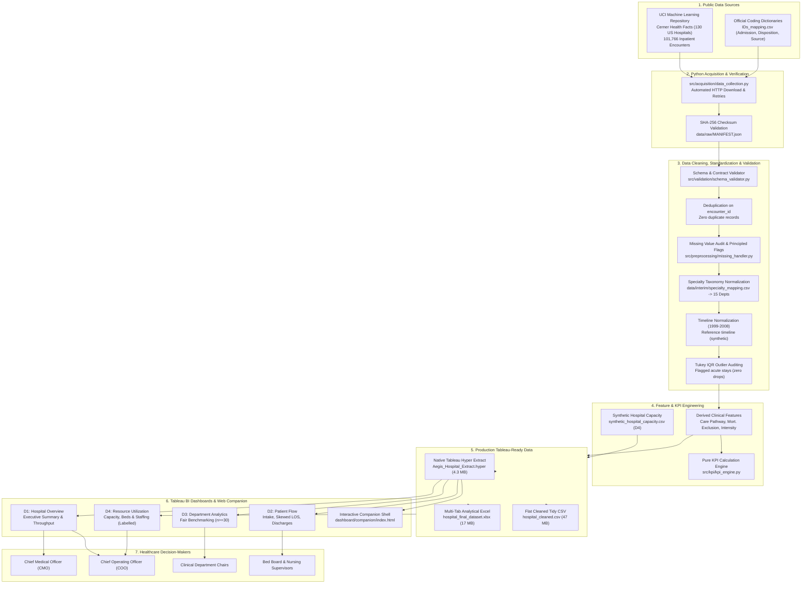

# Aegis.dv – System Architecture Diagram

```mermaid
graph TD
    subgraph Sources ["1. Public Data Sources"]
        UCI["UCI Machine Learning Repository<br/>Cerner Health Facts (130 US Hospitals)<br/>101,766 Inpatient Encounters"]
        MAP["Official Coding Dictionaries<br/>IDs_mapping.csv (Admission, Disposition, Source)"]
    end

    subgraph Acquisition ["2. Python Acquisition & Verification"]
        ACQ["src/acquisition/data_collection.py<br/>Automated HTTP Download & Retries"]
        CHK["SHA-256 Checksum Validation<br/>data/raw/MANIFEST.json"]
    end

    subgraph Pipeline ["3. Data Cleaning, Standardization & Validation"]
        VAL["Schema & Contract Validator<br/>src/validation/schema_validator.py"]
        DEDUP["Deduplication on encounter_id<br/>Zero duplicate records"]
        MISS["Missing Value Audit & Principled Flags<br/>src/preprocessing/missing_handler.py"]
        DEPT["Specialty Taxonomy Normalization<br/>data/interim/specialty_mapping.csv -> 15 Depts"]
        TIME["Timeline Normalization (1999-2008)<br/>Reference timeline (synthetic)"]
        OUT["Tukey IQR Outlier Auditing<br/>Flagged acute stays (zero drops)"]
    end

    subgraph FeatureKPI ["4. Feature & KPI Engineering"]
        FEAT["Derived Clinical Features<br/>Care Pathway, Mort. Exclusion, Intensity"]
        KPI["Pure KPI Calculation Engine<br/>src/kpi/kpi_engine.py"]
        SYNTH["Synthetic Hospital Capacity<br/>synthetic_hospital_capacity.csv (D4)"]
    end

    subgraph Exports ["5. Production Tableau-Ready Data"]
        HYPER["Native Tableau Hyper Extract<br/>Aegis_Hospital_Extract.hyper (4.3 MB)"]
        XLSX["Multi-Tab Analytical Excel<br/>hospital_final_dataset.xlsx (17 MB)"]
        CSV["Flat Cleaned Tidy CSV<br/>hospital_cleaned.csv (47 MB)"]
    end

    subgraph Presentation ["6. Tableau BI Dashboards & Web Companion"]
        D1["D1: Hospital Overview<br/>Executive Summary & Throughput"]
        D2["D2: Patient Flow<br/>Intake, Skewed LOS, Discharges"]
        D3["D3: Department Analytics<br/>Fair Benchmarking (n>=30)"]
        D4["D4: Resource Utilization<br/>Capacity, Beds & Staffing (Labelled)"]
        WEB["Interactive Companion Shell<br/>dashboard/companion/index.html"]
    end

    subgraph Stakeholders ["7. Healthcare Decision-Makers"]
        CMO["Chief Medical Officer (CMO)"]
        COO["Chief Operating Officer (COO)"]
        CHAIR["Clinical Department Chairs"]
        NURSE["Bed Board & Nursing Supervisors"]
    end

    UCI --> ACQ
    MAP --> ACQ
    ACQ --> CHK
    CHK --> VAL
    VAL --> DEDUP
    DEDUP --> MISS
    MISS --> DEPT
    DEPT --> TIME
    TIME --> OUT
    OUT --> FEAT
    FEAT --> KPI
    SYNTH --> Exports
    FEAT --> Exports
    Exports --> HYPER
    Exports --> XLSX
    Exports --> CSV
    HYPER --> D1
    HYPER --> D2
    HYPER --> D3
    Exports --> D4
    HYPER --> WEB
    D1 --> CMO
    D1 --> COO
    D2 --> NURSE
    D3 --> CHAIR
    D4 --> COO
```

